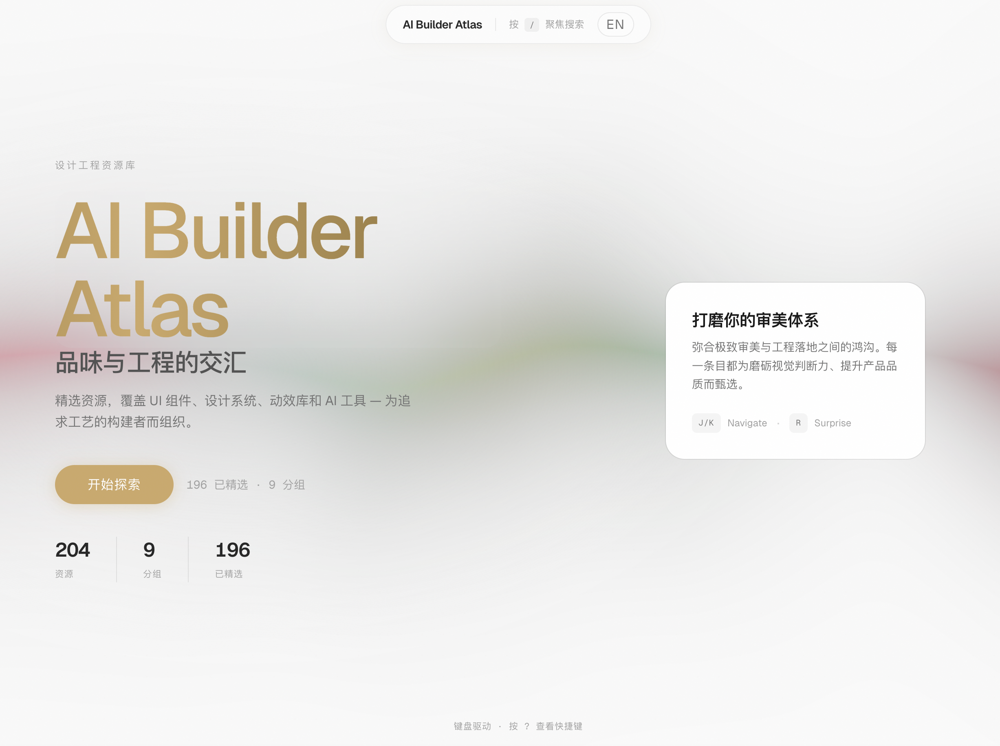
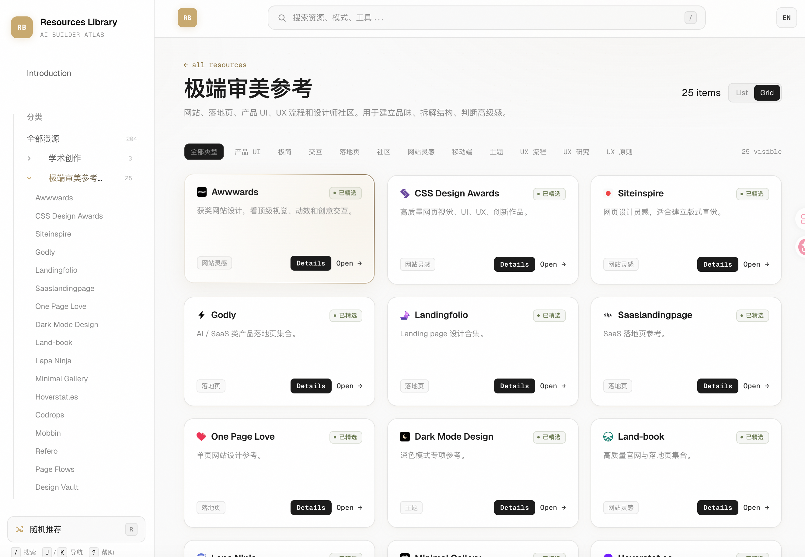

# AI Builder Atlas · Resources Library

A curated design-engineering resource library for builders who care about UI craft, engineering foundations, documentation systems, AI workflows, and quality verification.

Live site: https://resource-library-wheat.vercel.app/



## Overview

Resources Library is a static, Git-backed catalog of high-signal tools and references. It currently contains **204 resources** across **9 groups**, now backed by Astro Content Collections rather than one large runtime JSON payload.

The project remains deliberately lightweight: no backend, no database, no runtime writes. Resource changes are reviewed through Git, then the static site is rebuilt for Vercel or Cloudflare Pages.

## Features

- Astro-generated resource, group, tag, changelog, about, and search pages.
- Pagefind full-text search over generated HTML output.
- Faceted browsing by group, type, tag, pricing, language, and difficulty.
- Shareable resource detail pages with related-resource recommendations.
- Bilingual UI chrome, theme switching, local favorites, and a command palette.
- Schema-validated Markdown content files with build-time checks.
- Static deployment to Vercel or Cloudflare Pages with no backend service.



## Tech Stack

- Astro
- TypeScript
- Bun
- Content Collections
- Tailwind CSS v4
- Pagefind
- Small React islands for focused interactivity
- Vercel / Cloudflare Pages

## Project Structure

```text
.
├── src/
│   ├── content.config.ts
│   ├── content/
│   │   ├── resources/
│   │   └── groups/
│   ├── pages/
│   ├── layouts/
│   ├── components/
│   ├── lib/
│   └── styles/global.css
├── scripts/
│   ├── migrate-resources.ts
│   ├── new-resource.ts
│   ├── validate-content.ts
│   ├── check-links.ts
│   ├── fetch-favicons.ts
│   └── generate-screenshots.ts
├── public/
│   ├── favicons/
│   └── screenshots/
├── docs/
└── astro.config.mjs
```

## Getting Started

Install dependencies:

```bash
bun install
```

Run the development server:

```bash
bun run dev
```

Build for production:

```bash
bun run build
```

Preview the production build:

```bash
bun run preview
```

## Resource Data

Canonical catalog data now lives in Astro Content Collections:

- `src/content/resources/*.md`
- `src/content/groups/*.md`

Each resource stores card metadata in frontmatter and richer editorial notes in the Markdown body. The schema in `src/content.config.ts` validates URLs, statuses, pricing, language, difficulty, dates, and asset paths during the build.

Legacy JSON files remain only as migration inputs for `bun run migrate:resources`.

## Adding Resources

Create a new Markdown entry with the Astro helper:

```bash
bun run new:resource \
  --title="Motion Primitives" \
  --url="https://motion-primitives.com" \
  --group="ui-base" \
  --type="library" \
  --summary="Copy-paste motion components built on motion." \
  --tags="motion,ui" \
  --language="en"
```

Then validate and build:

```bash
bun run validate:content
bun run check
bun run build
```

For contributors, submit a GitHub Issue using the resource submission template. Approved issues are reviewed through Git before publication.

More details:

- [CONTRIBUTING.md](./CONTRIBUTING.md)
- [Resource update workflow](./docs/resource-update-workflow.md)

## Deployment

The production site is static Astro output and can be deployed to either platform:

| Platform | Build command | Output directory | Install command |
| --- | --- | --- | --- |
| Vercel | `bun run build` | `dist` | `bun install` |
| Cloudflare Pages | `bun run build` | `dist` | `bun install` |

Typical flow:

```text
Edit Markdown / approve issue
        ↓
Pull request
        ↓
CI: check + validate + build
        ↓
Merge
        ↓
Static deploy
```

`bun run check:links` is available for maintenance and also runs weekly in GitHub Actions, but external-network failures are not part of the local release gate.

## License

This repository does not currently declare a license. Add one before redistributing or reusing the project outside its current owner context.
